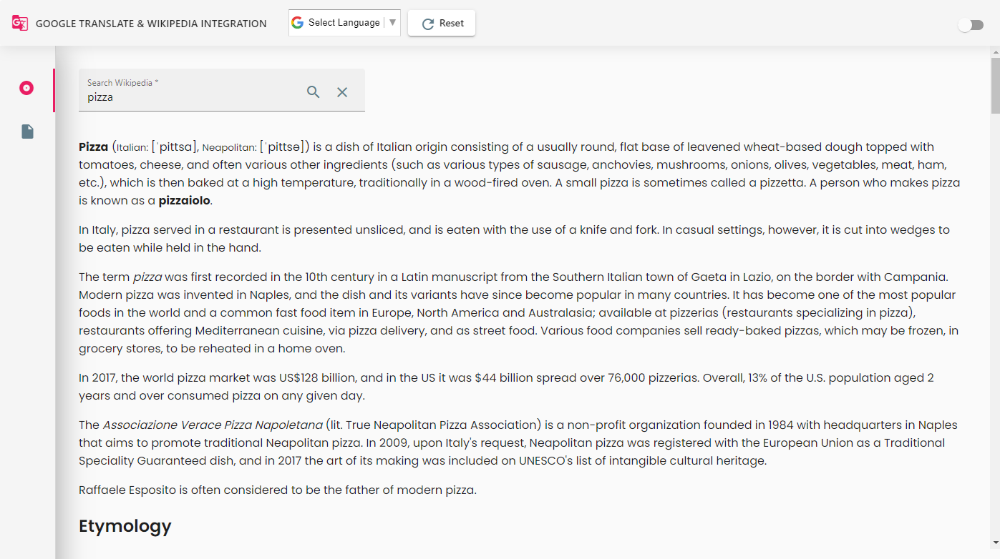
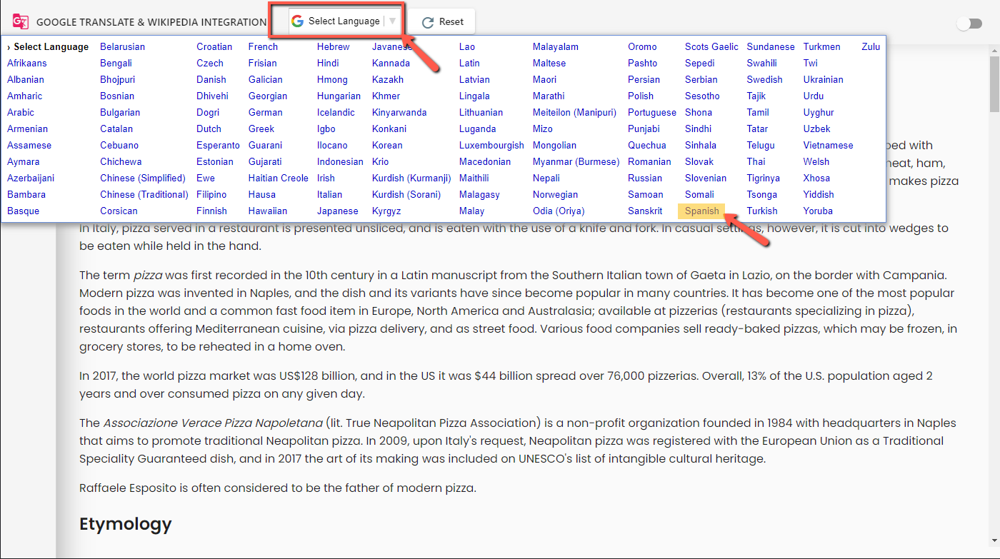
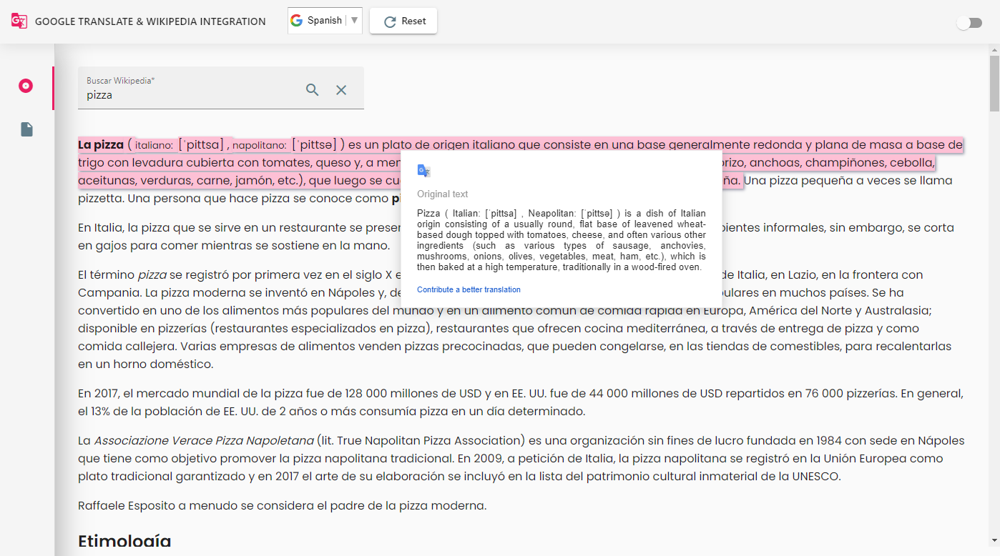

<h1 align="center"><a href="http://themeswitcher.umamaheswarid.com/" target="_blank">Google Translator & wikipedia Integration</a></h1>

  
   
        Google Translator & wikipedia Integration is a Angular version 14.1.0 web applications developed to transulate Wikipedia page into any Language using Google Translator.
   
   

## Live Working Demo 

http://googletranslator.umamaheswarid.com/

## Features
   - <b>Google Translator</b> : 132 Language translation
   - <b>Wikipedia</b> : Integrated with Wikipedia API to reterive the Plain HTML content   
   - <b>Page Switch</b> : Stores the Language selection and applies dynamically to all loading content   

## Screens Preview
  ### Home Screens
  
      

  ### Language Selection Screens
  
      

  ### Language Transulated & Quick orginal content preview Screens  
  
   

## Development server

Run `ng serve` for a dev server. Navigate to `http://localhost:4200/`. The app will automatically reload if you change any of the source files.

## Build

Run `ng build` to build the project. The build artifacts will be stored in the `dist/` directory.

## Further help

To get more help on the Angular CLI use `ng help` or go check out the [Angular CLI Overview and Command Reference](https://angular.io/cli) page.
